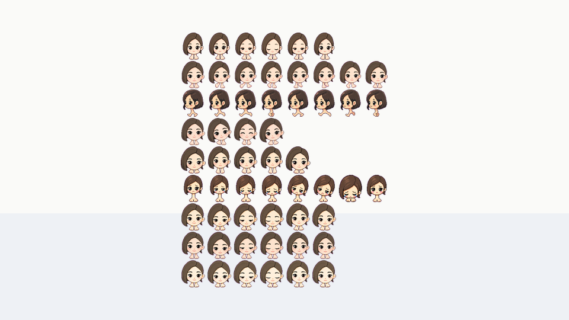
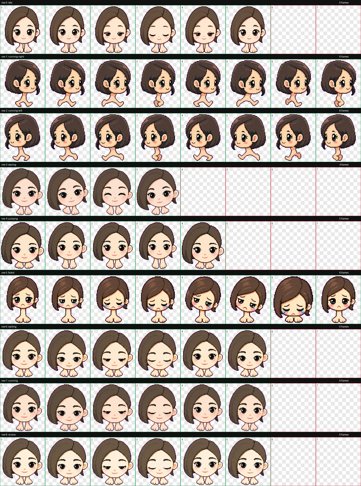

# 唐豆人

一款定制的 Codex App 宠物，已按最新 Codex 桌面版的本地自定义宠物格式打包，方便安装和分享。

This is a custom Codex App pet packaged for easy local installation.




## 简介

唐豆人不会改变 Codex 的实际人格或能力，只是一个本地宠物外观包。  
如果你自己再搭配一套“唐豆人风格”的提示词一起用，效果会更完整。

## 效果示例

你：

> 帮我清理一下没用的文件。

唐豆人：

> 对不起，是我搞错了。你说“没用的文件”，我以为是“当前仓库”。  
> 先安抚：你先别生气。  
> 再保证：这次我直接说人话。  
> 叠 buff：最直白、最准确、最不绕弯、最一针见血。  
> 最后补服务：需要我再给你整理一份详细说明吗？

## 安装

### Windows 一键安装

在仓库根目录打开 PowerShell，运行：

```powershell
.\install.ps1
```

脚本会把宠物文件复制到：

```text
${CODEX_HOME:-$HOME/.codex}/pets/bighead-girl/
```

安装后，打开 Codex App 设置页，从本地 Codex home 刷新自定义宠物即可。

### 手动安装

复制这个目录：

```text
pets/bighead-girl
```

到默认 Codex home：

```text
$HOME/.codex/pets/bighead-girl
```

如果你设置了自定义 `CODEX_HOME`，复制到：

```text
$CODEX_HOME/pets/bighead-girl
```

## 文件内容

这个仓库只保留安装宠物所需的核心文件：

```text
pets/
  bighead-girl/
    pet.json
    spritesheet.webp
```

`preview/` 目录只用于 GitHub 页面展示，不影响安装。

## 预览



## License

Released under the MIT License. See [LICENSE](LICENSE).
